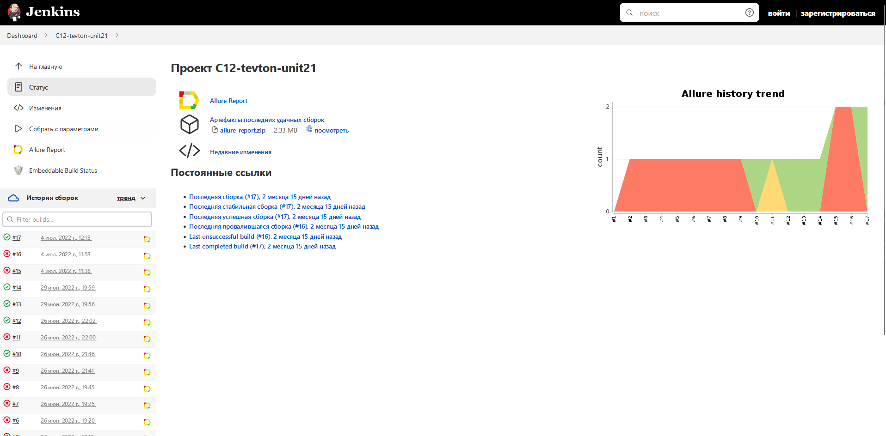
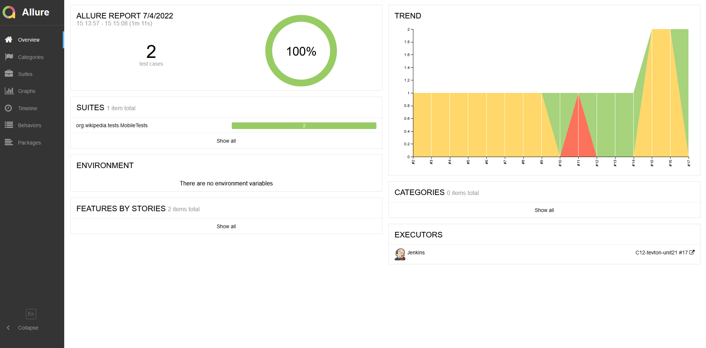
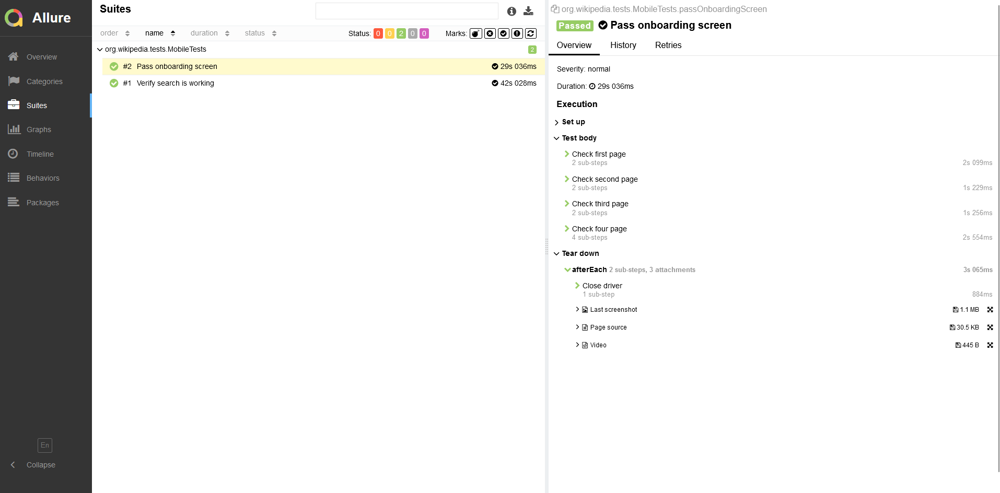
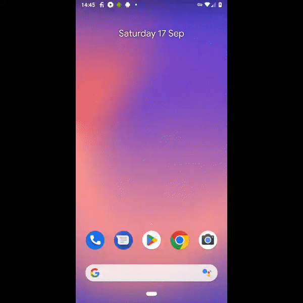

# Automated mobile tests for Wikipedia app on Android

## :tv: Contents

- <a href="#tv-technology-stack">Technology stack</a>
- <a href="#tv-launch">Launch</a>
- <a href="#tv-jenkins-build">Jenkins build</a>
- <a href="#tv-Test-results-report-in-Allure-Report">Test results report in Allure Report</a>
- <a href="#tv-Video-attach-example">Video attach example</a>

## :tv: Technology stack

<p align="center">


</p>

## :tv: Launch

### To launch tests remotely on Browserstack use the following command:

```
gradle clean test
```

### Launch tests on the local machine with emulation

You must have Android Studio and Appium installed and configured, and edit LocalConfig.properties file to match device and OS version yours emulation device.
To launch test locally use the following command:

```
gradle clean test -Dhost=local
```

##  [Jenkins build](https://jenkins.autotests.cloud/job/C12-tevton-unit21/)

<p align="center">
  
</p>

##  Test results report in [Allure Report](https://jenkins.autotests.cloud/job/C12-tevton-unit21/allure/)
### :pushpin: Allure report main page

<p align="center">

</p>

### :pushpin: The test suite

<p align="center">

</p>

##  Video attach example
Each test in the report is accompanied by a video. One such video is shown below.
<p align="center">
  
</p>